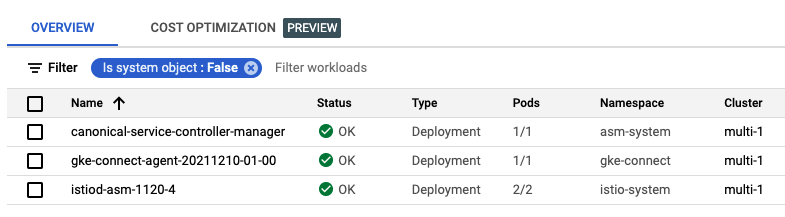
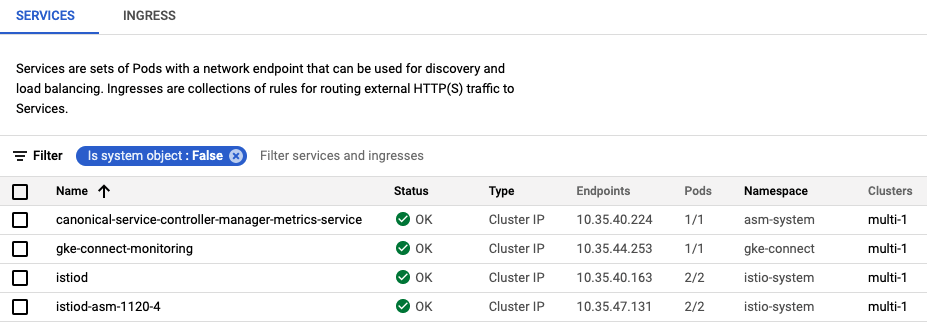
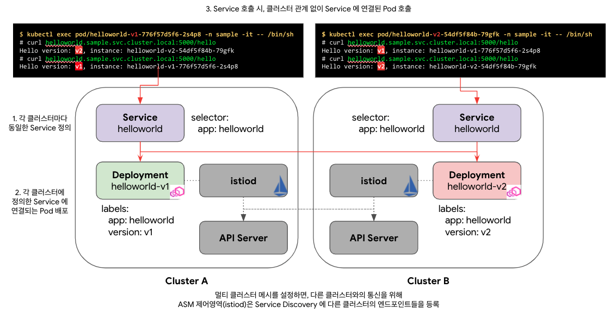
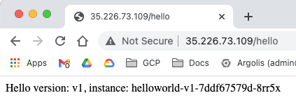
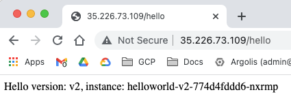

## 1. 데모 환경을 위한 환경 변수 세팅
   ```
   # CLUSTER-1 for multi-cluster
   export PROJECT_1=kw-gke-prj
   export CLUSTER_1=asm-multi-neg-1
   export LOCATION_1=us-central1-c
   
   # CLUSTER-2 for multi-cluster
   export PROJECT_2=kw-gke-prj
   export CLUSTER_2=asm-multi-neg-2
   export LOCATION_2=asia-northeast1-c

   # namespace for application deploy
   export NAMESPACE=sample
   ```

## 2. Cluster_1 생성 및 설정
- create GKE ${CLUSTER_1}
   ```
   gcloud container clusters create ${CLUSTER_1} \
    --project=${PROJECT_1} \
    --zone=${LOCATION_1} \
    --machine-type=e2-standard-4 \
    --num-nodes=3 \
    --workload-pool=${PROJECT_1}.svc.id.goog
   ```

- certify GKE ${CLUSTER_1}
   ```
   gcloud container clusters get-credentials ${CLUSTER_1} \
    --project=${PROJECT_1} \
    --zone=${LOCATION_1}
    
   export CTX_1="gke_${PROJECT_1}_${LOCATION_1}_${CLUSTER_1}"
   ```

- deploy application to ${NAMESPACE} namespace
   ```
   kubectl create --context=${CTX_1} namespace ${NAMESPACE}
   kubectl --context=${CTX_1} apply -f ./kube/cluster-1.yaml --namespace ${NAMESPACE}
   ```

- testing for ${CLUSTER_1}

   ***All traffic is forwared to pods(v2) within the ${CLUSTER_1}***

   ```
   $ kubectl get po,svc --context=${CTX_1} --namespace ${NAMESPACE}
   NAME                                 READY   STATUS    RESTARTS   AGE
   pod/helloworld-v1-776f57d5f6-2b6qk   1/1     Running   0          34s

   NAME                 TYPE        CLUSTER-IP   EXTERNAL-IP   PORT(S)    AGE
   service/helloworld   ClusterIP   10.8.5.194   <none>        5000/TCP   34s

   $ kubectl --context=${CTX_1} --namespace ${NAMESPACE} exec pod/helloworld-v1-776f57d5f6-2b6qk -it -- /bin/sh
   # curl helloworld.sample.svc.cluster.local/hello
   Hello version: v1, instance: helloworld-v1-776f57d5f6-2b6qk
   # curl helloworld.sample.svc.cluster.local/hello
   Hello version: v1, instance: helloworld-v1-776f57d5f6-2b6qk
   # curl helloworld.sample.svc.cluster.local/hello
   Hello version: v1, instance: helloworld-v1-776f57d5f6-2b6qk
   # curl helloworld.sample.svc.cluster.local/hello
   Hello version: v1, instance: helloworld-v1-776f57d5f6-2b6qk
   ```

## 3. Setting ${CLUSTER_2}
- create GKE ${CLUSTER_2}
   ```
   gcloud container clusters create ${CLUSTER_2} \
    --project=${PROJECT_2} \
    --zone=${LOCATION_2} \
    --machine-type=e2-standard-4 \
    --num-nodes=3 \
    --workload-pool=${PROJECT_2}.svc.id.goog
   ```
- certify GKE ${CLUSTER_2}
   ```
   gcloud container clusters get-credentials ${CLUSTER_2} \
    --project=${PROJECT_2} \
    --zone=${LOCATION_2}

   export CTX_2="gke_${PROJECT_2}_${LOCATION_2}_${CLUSTER_2}"
   ```

- deploy application to ${NAMESPACE} namespace
   ```
   kubectl create --context=${CTX_2} namespace ${NAMESPACE}
   kubectl --context=${CTX_2} apply -f ./kube/cluster-2.yaml --namespace ${NAMESPACE}
   ```

- testing for ${CLUSTER_2}

   ***All traffic is forwared to pods(v2) within the ${CLUSTER_2}***
   ```
   $ kubectl get po,svc --context=${CTX_2} --namespace ${NAMESPACE}
   NAME                                READY   STATUS    RESTARTS   AGE
   pod/helloworld-v2-54df5f84b-t2c5g   1/1     Running   0          58s

   NAME                 TYPE        CLUSTER-IP      EXTERNAL-IP   PORT(S)    AGE
   service/helloworld   ClusterIP   10.104.11.145   <none>        5000/TCP   59s
      
   $ kubectl --context=${CTX_2} --namespace ${NAMESPACE} exec pod/helloworld-v2-54df5f84b-t2c5g -it -- /bin/sh
   # curl helloworld.sample.svc.cluster.local/hello
   Hello version: v2, instance: helloworld-v2-54df5f84b-t2c5g
   # curl helloworld.sample.svc.cluster.local/hello
   Hello version: v2, instance: helloworld-v2-54df5f84b-t2c5g
   # curl helloworld.sample.svc.cluster.local/hello
   Hello version: v2, instance: helloworld-v2-54df5f84b-t2c5g
   # curl helloworld.sample.svc.cluster.local/hello
   Hello version: v2, instance: helloworld-v2-54df5f84b-t2c5g
   ```

## 4. Install ASM
- download asmcli to install ASM
   ```
   curl https://storage.googleapis.com/csm-artifacts/asm/asmcli_1.12 > asmcli
   chmod +x asmcli
   ```

- install ASM to ${CLUSTER_1}.

   [macOS isn't supported for installation ASM](https://cloud.google.com/service-mesh/docs/unified-install/get-started#install_required_tools)
   Also, the ingress gateway is not installed now.
   ```
   ./asmcli install \
   --project_id ${PROJECT_1} \
   --cluster_name ${CLUSTER_1} \
   --cluster_location ${LOCATION_1} \
   --output_dir ./anthos-service-mesh \
   --enable_all  \
   --ca mesh_ca
   ```
   - Workloads

      

   - Services

         

- install ASM to ${CLUSTER_2}.
   ```
   ./asmcli install \
   --project_id ${PROJECT_2} \
   --cluster_name ${CLUSTER_2} \
   --cluster_location ${LOCATION_2} \
   --output_dir ./anthos-service-mesh \
   --enable_all  \
   --ca mesh_ca
   ```

   - [Injecting sidecar proxies](https://cloud.google.com/service-mesh/docs/proxy-injection)
   ```
   export REVISION=$(kubectl get deploy -n istio-system -l app=istiod -o jsonpath={.items[*].metadata.labels.'istio\.io\/rev'}'{"\n"}')
   ## REVISION=asm-1120-4

   kubectl --context=${CTX_1} label namespace ${NAMESPACE} istio.io/rev=${REVISION} --overwrite
   kubectl --context=${CTX_1} rollout restart deployment helloworld-v1 --namespace ${NAMESPACE}
   kubectl --context=${CTX_2} label namespace ${NAMESPACE} istio.io/rev=${REVISION} --overwrite
   kubectl --context=${CTX_2} rollout restart deployment helloworld-v2 --namespace ${NAMESPACE}
   ```

## 5. Setting for multi cluster mesh
- [create firewall rule](https://cloud.google.com/service-mesh/docs/unified-install/gke-install-multi-cluster#create_firewall_rule)   
   ```
   function join_by { local IFS="$1"; shift; echo "$*"; }
   ALL_CLUSTER_CIDRS=$(for P in $PROJECT_1 $PROJECT_2; do gcloud --project $P container clusters list --filter="name:($CLUSTER_1,$CLUSTER_2)" --format='value(clusterIpv4Cidr)'; done | sort | uniq)
   ALL_CLUSTER_CIDRS=$(join_by , $(echo "${ALL_CLUSTER_CIDRS}"))
   ALL_CLUSTER_NETTAGS=$(for P in $PROJECT_1 $PROJECT_2; do gcloud --project $P compute instances list  --filter="name:($CLUSTER_1,$CLUSTER_2)" --format='value(tags.items.[0])' ; done | sort | uniq)
   ALL_CLUSTER_NETTAGS=$(join_by , $(echo "${ALL_CLUSTER_NETTAGS}"))
   ```

   ```
   gcloud compute firewall-rules create istio-multicluster-pods \
    --allow=tcp,udp,icmp,esp,ah,sctp \
    --direction=INGRESS \
    --priority=900 \
    --source-ranges="${ALL_CLUSTER_CIDRS}" \
    --target-tags="${ALL_CLUSTER_NETTAGS}" --quiet
    ```

- [configure endpoint discovery between clusters](https://cloud.google.com/service-mesh/docs/unified-install/gke-install-multi-cluster#configure_endpoint_discovery_between_clusters)
   ```
   ./asmcli create-mesh \
    ${PROJECT_1} \
    ${PROJECT_1}/${LOCATION_1}/${CLUSTER_1} \
    ${PROJECT_2}/${LOCATION_2}/${CLUSTER_2}
   ```
   
   output

   ```
   $ gcloud container hub memberships list
   NAME: multi-22
   EXTERNAL_ID: 4f1e5a5d-f685-4467-a636-bb493d6cf8ec

   NAME: multi-11
   EXTERNAL_ID: f98dcdfb-46a0-4ad8-b522-5f59d8f04ba8
   `````

## 6. test for multi cluster mesh

   

   All traffic is forwared to pods(v1, v2) of the ${CLUSTER_1} and ${CLUSTER_2}

   ```
   $ kubectl get po,svc --context=${CTX_1} --namespace ${NAMESPACE}
   NAME                                READY   STATUS    RESTARTS   AGE
   pod/helloworld-v1-686557cc7-h9hpg   2/2     Running   0          3m11s

   NAME                 TYPE        CLUSTER-IP   EXTERNAL-IP   PORT(S)    AGE
   service/helloworld   ClusterIP   10.8.5.194   <none>        5000/TCP   30m
  
   $ kubectl --context=${CTX_1} --namespace ${NAMESPACE} exec pod/helloworld-v1-686557cc7-h9hpg  -it -- /bin/sh
   # curl helloworld.sample.svc.cluster.local/hello
   Hello version: v1, instance: helloworld-v1-686557cc7-h9hpg
   # curl helloworld.sample.svc.cluster.local/hello
   Hello version: v2, instance: helloworld-v2-5c7f5c4f6d-wnzl5
   # curl helloworld.sample.svc.cluster.local/hello
   Hello version: v1, instance: helloworld-v1-686557cc7-h9hpg
   # curl helloworld.sample.svc.cluster.local/hello
   Hello version: v2, instance: helloworld-v2-5c7f5c4f6d-wnzl5 
   ```

   ```
   $ kubectl get po,svc --context=${CTX_2} --namespace ${NAMESPACE}
   NAME                                 READY   STATUS    RESTARTS   AGE
   pod/helloworld-v2-5c7f5c4f6d-wnzl5   2/2     Running   0          4m8s

   NAME                 TYPE        CLUSTER-IP      EXTERNAL-IP   PORT(S)    AGE
   service/helloworld   ClusterIP   10.104.11.145   <none>        5000/TCP   26m
  
   $ kubectl --context=${CTX_2} --namespace ${NAMESPACE} exec pod/helloworld-v2-5c7f5c4f6d-wnzl5  -it -- /bin/sh
   # curl helloworld.sample.svc.cluster.local/hello
   Hello version: v2, instance: helloworld-v2-5c7f5c4f6d-wnzl5
   # curl helloworld.sample.svc.cluster.local/hello
   Hello version: v1, instance: helloworld-v1-686557cc7-h9hpg
   # curl helloworld.sample.svc.cluster.local/hello
   Hello version: v2, instance: helloworld-v2-5c7f5c4f6d-wnzl5
   # curl helloworld.sample.svc.cluster.local/hello
   Hello version: v1, instance: helloworld-v1-686557cc7-h9hpg
   ```


## 7. Install ingrss-gateway to ${CLUSTER-1} for multi cluster mesh

- [Install an ingress gateway](https://cloud.google.com/service-mesh/docs/gateways#deploy_gateways)

   Gateways are user workloads, and as a best practice, they shouldn't be deployed in the control plane namespace. Enable auto-injection on the gateway by applying a a revision label on the gateway namespace. The revision label is used by the sidecar injector webhook to associate injected proxies with a particular control plane revision.
   ```
   export GATEWAY_NAMESPACE=istio-ingress

   kubectl create namespace ${GATEWAY_NAMESPACE} --context=${CTX_1} 
   kubectl --context=${CTX_1} label namespace ${GATEWAY_NAMESPACE} istio.io/rev=${REVISION} --overwrite

   kubectl apply --context=${CTX_1} -n ${GATEWAY_NAMESPACE} -f ./anthos-service-mesh/samples/gateways/istio-ingressgateway

   ```
   ```
   $ kubectl --context=${CTX_1} -n ${GATEWAY_NAMESPACE} get po,svc
   NAME                                        READY   STATUS    RESTARTS   AGE
   pod/istio-ingressgateway-66d9b945dc-6djt9   1/1     Running   0          58s
   pod/istio-ingressgateway-66d9b945dc-n2hxc   1/1     Running   0          58s
   pod/istio-ingressgateway-66d9b945dc-qm7qj   1/1     Running   0          58s

   NAME                           TYPE           CLUSTER-IP   EXTERNAL-IP     PORT(S)                                      AGE
   service/istio-ingressgateway   LoadBalancer   10.36.0.79   35.226.73.109   15021:31594/TCP,80:30525/TCP,443:30317/TCP   58s
   ```

- deploy Gateway, Virtual Service to ${CLUSTER_1} for ingress gateway
   ```
   kubectl --context=${CTX_1} apply -f ./kube/istio.yaml --namespace ${NAMESPACE}
   ```

   output
   ```
   $ kubectl get gateway --context=${CTX_1} --namespace ${NAMESPACE}
   NAME            AGE
   hello-gateway   16s
   
   $ kubectl get virtualservice --context=${CTX_1} --namespace ${NAMESPACE}
   NAME       GATEWAYS            HOSTS   AGE
   hello-vs   ["hello-gateway"]   ["*"]   27s
   ```

## 6. test for multi cluster mesh throught Ingress Gateway
   ```
   $ curl http://35.226.73.109:80/hello
   Hello version: v1, instance: helloworld-v1-7ddf67579d-8rr5x

   $ curl http://35.226.73.109:80/hello
   Hello version: v2, instance: helloworld-v2-774d4fddd6-nxrmp

   $ curl http://35.226.73.109:80/hello
   Hello version: v1, instance: helloworld-v1-7ddf67579d-8rr5x

   $ curl http://35.226.73.109:80/hello
   Hello version: v2, instance: helloworld-v2-774d4fddd6-nxrmp
   ```
   

   


-------------------
Create Ingressgateway as ClusteIP type instead of Load Balancer Type
   ```
   export GATEWAY_NAMESPACE=istio-ingress

   kubectl create namespace ${GATEWAY_NAMESPACE} --context=${CTX_1} 
   kubectl --context=${CTX_1} label namespace ${GATEWAY_NAMESPACE} istio.io/rev=${REVISION} --overwrite

   kubectl apply --context=${CTX_1} -n ${GATEWAY_NAMESPACE} -f ./anthos-service-mesh/samples/gateways/istio-ingressgateway

   # change service of istio-ingressgateway
   kubectl apply --context=${CTX_1} -n ${GATEWAY_NAMESPACE} -f ./kube/istio-ingressgateway/service-for-istio-ingressgateway-1.yaml

   ```

   ```
   export GATEWAY_NAMESPACE=istio-ingress

   kubectl create namespace ${GATEWAY_NAMESPACE} --context=${CTX_2} 
   kubectl --context=${CTX_2} label namespace ${GATEWAY_NAMESPACE} istio.io/rev=${REVISION} --overwrite

   kubectl apply --context=${CTX_2} -n ${GATEWAY_NAMESPACE} -f ./anthos-service-mesh/samples/gateways/istio-ingressgateway
   # change service of istio-ingressgateway
   kubectl apply --context=${CTX_2} -n ${GATEWAY_NAMESPACE} -f ./kube/istio-ingressgateway/service-for-istio-ingressgateway-2.yaml

   ```
   export GKE_NODE_NETWORK_TAGS_1=gke-asm-multi-neg-1-91a85778-node
   export GKE_NODE_NETWORK_TAGS_2=gke-asm-multi-neg-2-f1cf644c-node

   gcloud compute firewall-rules create fw-allow-health-check-and-proxy-for-cluster-1-80 \
   --network=default \
   --action=allow \
   --direction=ingress \
   --target-tags=${GKE_NODE_NETWORK_TAGS_1} \
   --source-ranges=130.211.0.0/22,35.191.0.0/16 \
   --rules=tcp:80

   gcloud compute firewall-rules create fw-allow-health-check-and-proxy-for-cluster-2-80 \
   --network=default \
   --action=allow \
   --direction=ingress \
   --target-tags=${GKE_NODE_NETWORK_TAGS_2} \
   --source-ranges=130.211.0.0/22,35.191.0.0/16 \
   --rules=tcp:80

   gcloud compute firewall-rules create fw-allow-health-check-and-proxy-for-cluster-1-15021 \
   --network=default \
   --action=allow \
   --direction=ingress \
   --target-tags=${GKE_NODE_NETWORK_TAGS_1} \
   --source-ranges=130.211.0.0/22,35.191.0.0/16 \
   --rules=tcp:15021

   gcloud compute firewall-rules create fw-allow-health-check-and-proxy-for-cluster-2-15021 \
   --network=default \
   --action=allow \
   --direction=ingress \
   --target-tags=${GKE_NODE_NETWORK_TAGS_2} \
   --source-ranges=130.211.0.0/22,35.191.0.0/16 \
   --rules=tcp:15021

   gcloud compute firewall-rules create fw-allow-health-check-and-proxy-for-cluster-1-5000 \
   --network=default \
   --action=allow \
   --direction=ingress \
   --target-tags=${GKE_NODE_NETWORK_TAGS_1} \
   --source-ranges=130.211.0.0/22,35.191.0.0/16 \
   --rules=tcp:5000

   gcloud compute firewall-rules create fw-allow-health-check-and-proxy-for-cluster-2-5000 \
   --network=default \
   --action=allow \
   --direction=ingress \
   --target-tags=${GKE_NODE_NETWORK_TAGS_2} \
   --source-ranges=130.211.0.0/22,35.191.0.0/16 \
   --rules=tcp:5000

   gcloud compute firewall-rules create istio-webhook \
   --direction=INGRESS \
   --priority=1000 \
   --network=default \
   --action=ALLOW \
   --source-ranges=0.0.0.0/0 \
   --rules=tcp:15017

   ```

   output
   ```
   $ gcloud compute network-endpoint-groups list
   NAME: asm-ingress-http-1
   LOCATION: us-central1-c
   ENDPOINT_TYPE: GCE_VM_IP_PORT
   SIZE: 3

   NAME: asm-ingress-https-1
   LOCATION: us-central1-c
   ENDPOINT_TYPE: GCE_VM_IP_PORT
   SIZE: 3

   NAME: asm-ingress-http-2
   LOCATION: asia-northeast1-c
   ENDPOINT_TYPE: GCE_VM_IP_PORT
   SIZE: 3

   NAME: asm-ingress-https-2
   LOCATION: asia-northeast1-c
   ENDPOINT_TYPE: GCE_VM_IP_PORT
   SIZE: 3
   ```


Load Balancing --> CREATE LOAD BALANCER --> START CONFIGURATION ("HTTP(S) LOAD BALANCER")
- From Internet to my VMs or serverless services
- Classic HTTP(S) Load Balancer


